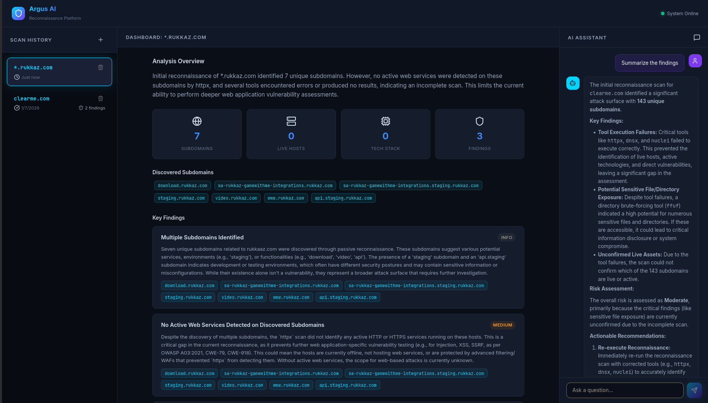
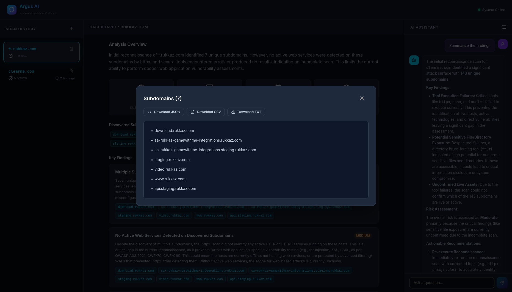
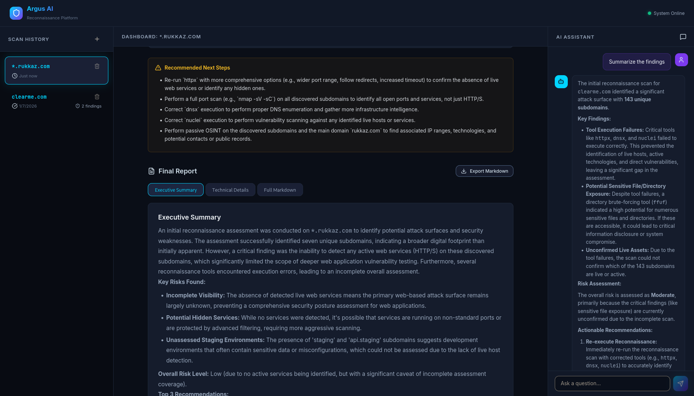

# Argus AI — Attack Surface Assessment Platform

An AI-powered reconnaissance platform built with LangGraph, FastAPI, and React. This platform orchestrates various security tools (like `subfinder`, `httpx`, `nuclei`) using a LangGraph workflow and analyzes the results using local LLMs (Ollama) and RAG.

## Screenshots





## Architecture

The platform uses a clean, three-tier architecture:

1.  **Frontend (React + Vite)**: A premium dark-themed UI with three panels:
    *   **Left**: Scan History and New Scan form.
    *   **Center**: Live execution logs, findings dashboard, and final markdown report.
    *   **Right**: AI Assistant chat with scan context.
2.  **Backend API (FastAPI)**: REST endpoints for scan management and a WebSocket for real-time progress streaming.
3.  **AI Engine (LangGraph + Ollama + ChromaDB)**:
    *   **Planner Agent**: Decides which tools to run based on the user's objective.
    *   **Execution Engine**: Runs the actual CLI tools concurrently (pure Python, no AI).
    *   **RAG System**: Enriches findings with CVE/CWE context from a local ChromaDB.
    *   **Analysis Agent**: Correlates findings, prioritizes risks, and explains them.
    *   **Report Agent**: Generates Executive and Technical summaries.

## Prerequisites

*   Python 3.13+
*   Node.js 22+
*   Security tools installed in your PATH: `subfinder`, `assetfinder`, `sublist3r`, `httpx`, `nuclei`, `dnsx`, `ffuf`, `katana`, `waybackurls`, `gospider`, `cloud_enum`.
*   **LLM Provider (Choose One)**:
    *   **Google Gemini (Recommended/Easiest)**: A Gemini API key (no local installation required).
    *   **Ollama (Local)**: Installed and running locally with the `phi3` or `llama3.1:8b` model.

## Configuration (Gemini API or Ollama)

By default, the platform is configured to use a local Ollama instance. However, **you do not need Ollama installed** if you provide a Gemini API Key. If a Gemini key is provided, the platform automatically bypasses Ollama and routes all agent orchestration to Gemini.

To configure Gemini:
```bash
# Copy the sample environment file
cp .env.sample .env

# Edit .env to add your API key
nano .env
```
Inside `.env`, set your Gemini API key:
```env
RECON_GEMINI_API_KEY="YOUR_GEMINI_API_KEY_HERE"
```
The platform will automatically start using Gemini for the Planner, Analysis, and Report agents.

## Setup & Running

### 1. Backend

The backend requires a Python virtual environment to avoid system package conflicts.

```bash
cd AI-Attack-Surface-Assessment-Platform
python3 -m venv .venv
source .venv/bin/activate
pip install -r backend/requirements.txt
```

Start the FastAPI server:
```bash
# Make sure your virtual environment is active!
export PYTHONPATH=$(pwd)
uvicorn backend.api.main:app --reload --host 0.0.0.0 --port 8000
```
*Note: On first run, it will initialize the SQLite database (`recon.db`) and build the ChromaDB RAG knowledge base in the `chroma_db` folder.*

### 2. Frontend

Open a new terminal window:

```bash
cd AI-Attack-Surface-Assessment-Platform/frontend
npm install
npm run dev
```

The frontend will start at `http://localhost:5173`.

## Usage

1.  Open the web interface.
2.  Click the **+** button in the left panel to start a new scan.
3.  Enter a target (e.g., `example.com`) and an optional objective.
4.  Watch the live progress in the center panel.
5.  Once completed, review the findings, download the report, or chat with the AI assistant on the right panel to ask questions about the results.
